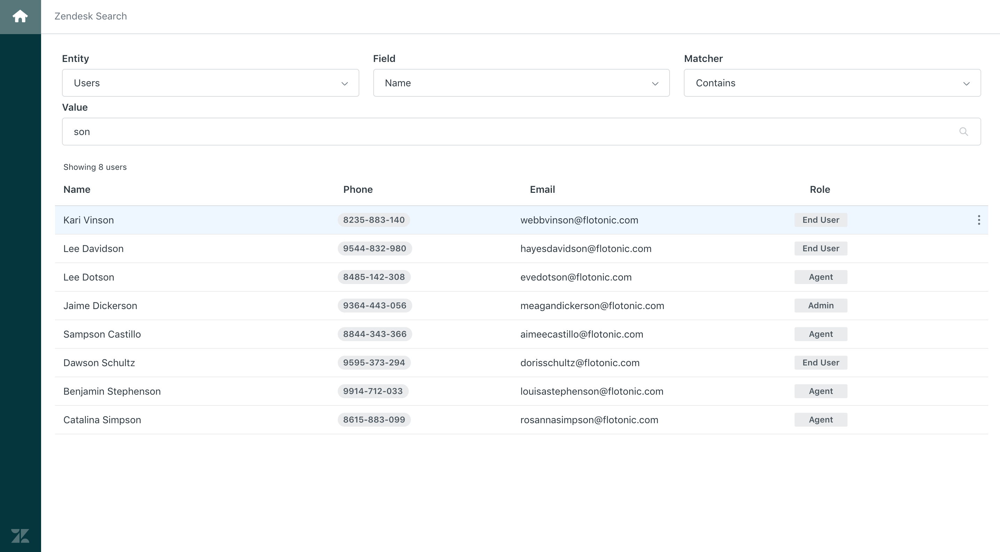

# ZenDesk Search
A fullstack TypeScript web app for searching ZenDesk data using React, Nest.js, and MongoDB.

This project is a [lerna](https://github.com/lerna/lerna) repo that contains separate packages for:
  - `search-ui` : a create-react-app based web app with a sprinkling of [zendeskgarden](https://garden.zendesk.com/).
  - `search-api` : a [Nest.JS](https://github.com/nestjs/nest) based API that queries data from a local mongodb.

## Getting Started

### Prerequisites
This project requires the following software to install and start correctly:
- [NodeJS v10+](https://nodejs.org/en/download/)
  - npm v5+
- [Docker](https://www.docker.com/get-started)
- [Docker Compose](https://docs.docker.com/compose/install/)


---
### Installing
To get the project up and running, follow these installation steps:


Run an npm install in the root project directory to instantiate lerna dependencies:
```bash
# cd to project root and run:
npm install
```

Next, run the following command to complete bootstrapping the `search-ui` and `search-api` packages:
```bash
npm run bootstrap
```
---
### Setting up local environment
With prerequisite software and package dependencies installed, the following steps will get the project running locally:


A MongoDB instance, with auth disabled, listening on port `27017` needs to be started.
```bash
# The start:db script uses docker-compose to pull a copy
# of `bitnami/mongodb:4.0`down from the docker hub
# and starts it on the default port.

npm run start:db
```
A few notes regarding this step:
  - If you've pulled from `bitnami/mongodb:4.0` to start a docker container locally in the past, a previous image with auth enabled may have been started. If that's the case, you can either switch to another minor version of `bitnami/mongodb` in the `docker-compose.yml` or force pull a fresh `bitnami/mongodb:4.0`.

  - If you're unable to install Docker or get the container up and running, you can alternatively start a local mongo instance directly on `27017`
    - **Warning**: the following `seed:db` script drops all collections from the connected mongo and seeds the challenge data in a fresh state. If using a local mongo instead of a Docker container, make sure any data you need to keep is appropriately backed up.

Once Mongo is up and accepting connections, you can run the following to seed it with the challenge data:

```bash
# This will drop all collections, make sure data is backed up if
# running against a non-containerized mongo instance

npm run seed:db
```

With the database up and seeded with data, the last steps are to start the `search-ui` and `search-api` projects:
```bash
# This script will start both the UI and API in the same shell,
# with stdout streamed from both. If you'd like to start the UI
# and API in separate shells, they can be run via
# `npm run start:ui` and `npm run start:api` respectively.

npm start
```

The UI will start a React app available at http://localhost:3000 which proxies calls back to the API at http://localhost:3001




Search interactions are done via the form controls at the top of the main content area, with matching search results rendered in a table below.

The intended entry point for this project is the UI via http://localhost:3000, however feel free to use your http client of choice to hit:
  - `http://localhost:3001/users/search`
  - `http://localhost:3001/tickets/search`
  - `http://localhost:3001/organizations/search`
  - These routes accept queryParams for the find condition logic, where:
    - `field` = String name of an entity field to search by
    - `value` = String value of the entity's field
    - `exact` = Boolean that will enable exact matching when `true`, optional otherwise.

## Running the tests
Both the UI and API project use Jest for running unit and integrated test suites. The UI relies heavily on [react-testing-library](https://github.com/testing-library/react-testing-library) for pseudo-integrated test runs, while the API uses Jest with helper libs from [Nest.JS](https://github.com/nestjs/nest) for unit and e2e specs.

All unit tests can be run from the rootDir via:
```bash
npm test
```
while the e2e tests for `search-api` can be run via:
```bash
npm run test:e2e
```

## Assumptions & Decisions
  - The API currently connects to the database without auth - this was to avoid possible issues introduced when pulling certain mongo images from docker hub in which prior auth config could carry over to other containers. In a real scenario, the API would use a ConfigService provider to access relevant env vars for authenticated interactions.

  - Due to general time constraints, DB query optimization and indexing has not been included.

  - There's a light amount of error handling throughout the UI and API, this should be more robust in a production scenario and integrated with a logging providers for app monitoring.

  - The UI application can be built for prod, but a deployment pipeline was not included due to time constraints.